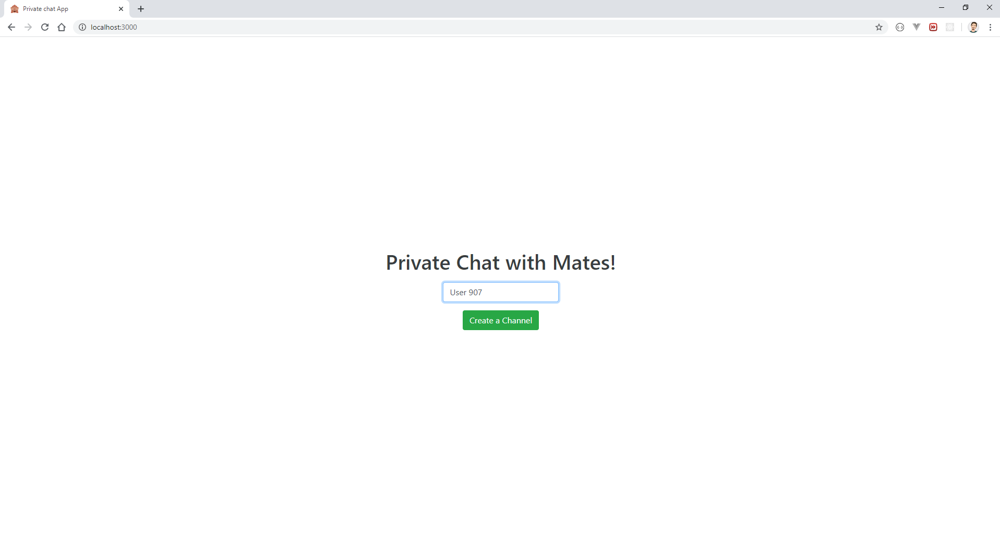

# private-chat

This is a small application for private chat. 1 Room can only have 2 people inside.

It uses `express, socket.io, ejs`. 

## How to use

first of all clone the repo

`git clone https://github.com/halilcakar/private-chat.git && cd private-chat`

and then install

`npm i`

then you need to copy .env.default to .env. bash script might be differen for you i'm using git bash generally so

`cp .env.default .env`

after these steps you can just run

`npm run dev` or `yarn dev`

I also added an option for SSL usage, if you have a generated ssl that you can use, you need to set the `SSL_KEY` and `SSL_CERT` parameters on `.env`

If you set those and make `APP_ENV=production` it will try to run the server on `https`. But for local testing you can just leave `.env` as it is.

## Thanks to: 
[favicon.io](https://favicon.io/) that provides that beautiful favicons.

## Some photos :)

